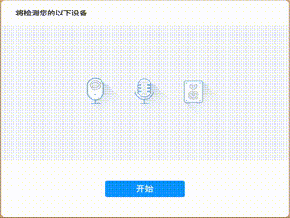

# agora-detector-react

> agora device detector for react

[](https://www.npmjs.com/package/agora-detector-react) [](https://standardjs.com)

*English | [简体中文](README.zh.md)*

## Introduction

This component can detect the customer`s microphone, camera and speaker devices, then give a detect report by callback. 

The detect of each collection devices will take an automatic detection(by javascript) and a subjective detection(by customer`s subjective feedback).

As long as one of the automatic detection and subjective detection fails, the component will stick the device a failed result.

**This component depends on Agora Web SDK NG, please make sure you use SDK version 4.0.0 or later.**

## Demo



## Install

```bash
npm install --save agora-detector-react
```

## Usage

```tsx
import React, { Component } from 'react';

import AgoraRTC from 'agora-rtc-sdk-ng';
import { AgoraDetector, DetectResults } from 'agora-detector-react';
import 'agora-detector-react/dist/index.css';

class Example extends Component {
  onComplete(report: DetectResults) {
    console.log(`Camera device: ${report.cameraResult.deviceLabel}, 
    result: ${report.cameraResult.result}`);
    console.log(`Microphone device: ${report.micResult.deviceLabel}, 
    result: ${report.micResult.result}`);
    console.log(`Speaker device: ${report.speakerResult.deviceLabel}, 
    result: ${report.speakerResult.result}`);
  }

  render() {
    return <AgoraDetector AgoraSDK={AgoraRTC} onComplete={onComplete}/>;
  }
}
```


## Props

### `AgoraSDK`

The object of AgoraWebSDK NG(version >= 4.0.0). 

### `width` (`string`)

the css width of agora detector component.

### `height` (`string`)

the css height of agora detector component.

## Notice

The automatic camera detection on Safari always returns success.

## License

MIT © [](https://github.com/)
