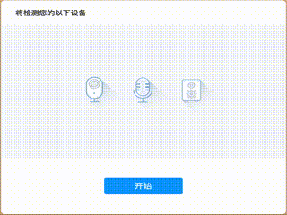

# agora-detector-vue

> agora device detector for vue

[](https://www.npmjs.com/package/agora-detector-vue)

*English | [简体中文](README.zh.md)*

## Introduction

This component can detect the customer`s microphone, camera and speaker devices, then give a detect report by callback. 

The detect of each collection devices will take an auto detection(by javascript) and a subjective detection(by customer`s subjective feedback).

As long as one of the auto detection and subjective detection fails, the component will stick the device a failed result.

**This component depends on Agora Web SDK NG, please make sure you use SDK version 4.0.0 or later.**

## Demo



## Install

```bash
npm install --save agora-detector-vue
```

## Usage

install the component

```js
// main.js
import AgoraDetector from 'agora-detector-vue';
import AgoraRTC from 'agora-rtc-sdk-ng';

Vue.config.productionTip = false;

Vue.use(AgoraDetector, { AgoraSDK: AgoraRTC });
```

use the detector component in your vue component.

```html
<template>
  <div id="app">
    <AgoraDetector class="detector" @onComplete="onComplete">
    </AgoraDetector>
  </div>
</template>

<script>
export default {
  name: 'app',
  methods: {
    onComplete(report) {
      console.log(`Camera device: ${report.cameraResult.deviceLabel}, 
      result: ${report.cameraResult.result}`);
      console.log(`Microphone device: ${report.micResult.deviceLabel}, 
      result: ${report.micResult.result}`);
      console.log(`Speaker device: ${report.speakerResult.deviceLabel}, 
      result: ${report.speakerResult.result}`);
    }
  }
};
</script>
```

## Props

### `AgoraSDK`

The object of Agora Web SDK NG(version >= 4.0.0). 

### `width` (`string`)

the width of agora detector component.

### `height` (`string`)

the height of agora detector component.

## Notice

- The automatic camera detection on Safari always returns success.


## License

MIT © [](https://github.com/)
