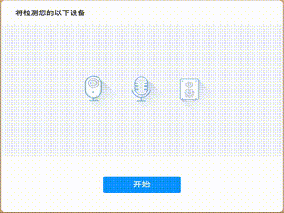

# agora-detector-vue

> vue 版本的 Agora 设备检测组件

[](https://www.npmjs.com/package/agora-detector-vue)

*简体中文 | [English](README.md)*

## 简介

这个组件可以检测使用者的麦克风、摄像头和扬声器，最终通过回调给出检测结果报告。

每个采集设备检测将分为主观检测（用户反馈）和客观检测（javascript 脚本）。

只要主观检测和客观检测之一失败，组件的最终检测结果中会将该设备标记为检测失败。

**该组件依赖于Agora Web SDK NG，确保您的 SDK 版本高于 4.0.0。**

## 演示



## 安装

```bash
npm install --save agora-detector-vue
```

## 使用

首先在入口文件中注册组件。

```js
// main.js
import vueDeviceDetector from 'agora-detector-vue';
import AgoraRTC from 'agora-rtc-sdk-ng';

Vue.config.productionTip = false;

Vue.use(vueDeviceDetector, { AgoraSDK: AgoraRTC });
```

use the detector component in your vue component.

```html
<template>
  <div id="app">
    <VueDeviceDetector class="detector" @onComplete="onComplete">
    </VueDeviceDetector>
  </div>
</template>

<script>
export default {
  name: 'app',
  methods: {
    onComplete(report) {
      console.log(`Camera device: ${report.cameraResult.deviceLabel}, 
      result: ${report.cameraResult.result}`);
      console.log(`Microphone device: ${report.micResult.deviceLabel}, 
      result: ${report.micResult.result}`);
      console.log(`Speaker device: ${report.speakerResult.deviceLabel}, 
      result: ${report.speakerResult.result}`);
    }
  }
};
</script>
```


## 参数

### `AgoraSDK`

完整的 Agora Web SDK NG 对象（4.0.0版本以上）。

### `width` (`string`)

检测组件的宽度（css接受的值）。

### `height` (`string`)

检测组件的高度（css接受的值）。

## 注意

Safari 上的摄像头自动检测总会返回成功。

## 代码许可

MIT © [](https://github.com/)
